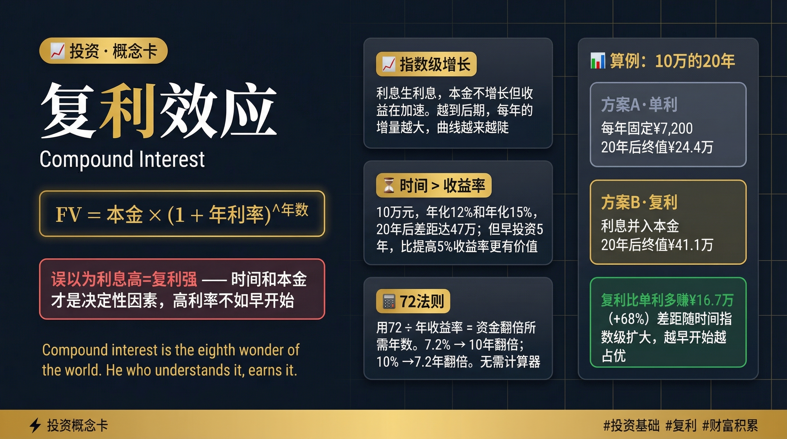

# 知识概念卡片生成器

> Concept Card Generator — 输入任意主题，一句话生成专业深色风格视觉卡片



## ✨ 功能特点

- **通用主题**：支持投资、金融、心理学、历史、科学、哲学、编程、语言等任何知识领域
- **专业设计**：纯黑金配色 · 深蓝黑底 (#0a0e1a) + 金色点缀 (#f0b429)
- **结构清晰**：三栏逻辑流 — 定义 → 机制 → 案例
- **自动生成**：说一句话即可，无需手动设计

## 🎨 视觉规范

| 元素 | 颜色 | 用途 |
|------|------|------|
| 背景 | `#0a0e1a` | 深蓝黑底 |
| 金色 | `#f0b429` | 标题/公式/关键词 |
| 白色 | `#ffffff` | 大标题 |
| 灰色 | `#9ca3af` | 次要文字 |
| 绿色 | `#22c55e` | 结论/正确选项 |
| 红色 | `#f87171` | 误区/警示 |

> ⚠️ **严格禁用**：蓝色、紫色、彩虹色等杂色干扰

## 📐 卡片结构

```
┌──────────────────┬──────────────────┬──────────────────┐
│  左侧：定义区     │  中间：3要点      │  右侧：案例      │
│                  │                  │                  │
│  · 标签 Badge   │  · 核心要点卡片1  │  · 具体场景      │
│  · 主标题        │  · 核心要点卡片2  │  · 方案A vs B   │
│  · 英文副标题    │  · 核心要点卡片3  │  · 结论框       │
│  · 公式/定义框   │                  │                  │
│  · 误区提示     │                  │                  │
│  · 金句引用     │                  │                  │
└──────────────────┴──────────────────┴──────────────────┘
```

## 🚀 快速使用

在支持此 Skill 的 AI Agent 中，直接说：

```
"帮我做一张关于复利的卡"
"生成一张锚定效应的概念卡"
"做一张关于量子力学的科普卡"
```

## 📁 示例卡片

以下是使用本生成器制作的示例卡片：

### AI 系列（2026-04-10 生成）

| 序号 | 主题 | 说明 |
|------|------|------|
| ① | [LLM · 大型语言模型](assets/card_llm.png) | Scale Law / Transformer / 涌现能力 |
| ② | [Harness Engineering · 具身工程](assets/card_harness.png) | Prompt Pattern / Evals / Guardrails |
| ③ | [Context Engineering · 上下文工程](assets/card_context.png) | RAG / 上下文压缩 / 信息检索 |
| ④ | [Agent · 人工智能代理](assets/card_agent.png) | Plan+Decompose / Tool Use / Memory |
| ⑤ | [AI · 人工智能](assets/card_ai.png) | 三大学派 / 窄AI vs AGI / 人机协作 |

### 投资系列

| 序号 | 主题 | 说明 |
|------|------|------|
| ① | [复利效应 · Compound Interest](assets/card_compound_interest.png) | 指数增长 / 72法则 / 单利 vs 复利算例 |
| ② | [机会成本 · Opportunity Cost](assets/card_opportunity_cost.png) | 隐形成本 / 预期收益 / 沉没成本谬误 |

## 🔧 文件结构

```
concept-card/
├── README.md                        # 本文件
├── SKILL.md                         # AI Agent Skill 说明
├── assets/
│   ├── template.html                # 完整 HTML 模板（浏览器直接打开）
│   ├── preview.png                  # 效果预览图
│   ├── card_llm.png                # 示例：LLM
│   ├── card_harness.png            # 示例：Harness Engineering
│   ├── card_context.png            # 示例：Context Engineering
│   ├── card_agent.png              # 示例：Agent
│   ├── card_ai.png                # 示例：AI
│   └── card_compound_interest.png  # 示例：复利
└── references/
    └── content-types.md            # 内容结构参考 + 图标规范
```

## 🎯 内容组织原则

每个卡片必须包含 **5 个模块**：

1. **核心定义**：一句话定义（≤30字）+ 英文名
2. **思维模型**（×3）：每个含图标 + 名称 + 标签 + 解释
3. **具体算例**：含两个对比选项 + 具体数字 + 结论
4. **误区提示**：最常见的理解错误（红色警示）
5. **金句**：英文原话 + 中文翻译

## 🏷️ 标签体系

```
投资类：#投资基础 #价值投资 #资产配置 #风险管理
心理类：#认知偏差 #行为金融 #心理模型 #决策
科学类：#科学原理 #技术科普 #万物原理
通用类：#学习 #认知升级 #概念 #思维模型
```

## ⚠️ 禁止事项

- ❌ 禁止显示序号/期数（如 "Day 1"、"第1天"）
- ❌ 禁止显示个人品牌（如 Kiko）
- ❌ 禁止使用蓝色/紫色/彩虹色配色
- ❌ 禁止内容空洞的泛泛而谈

## 📖 相关资源

- **Skill 下载**：https://github.com/EEvinci/concept-card
- **模板文件**：`assets/template.html`（浏览器直接打开预览）

## License

MIT · 欢迎 Star 和 Fork
